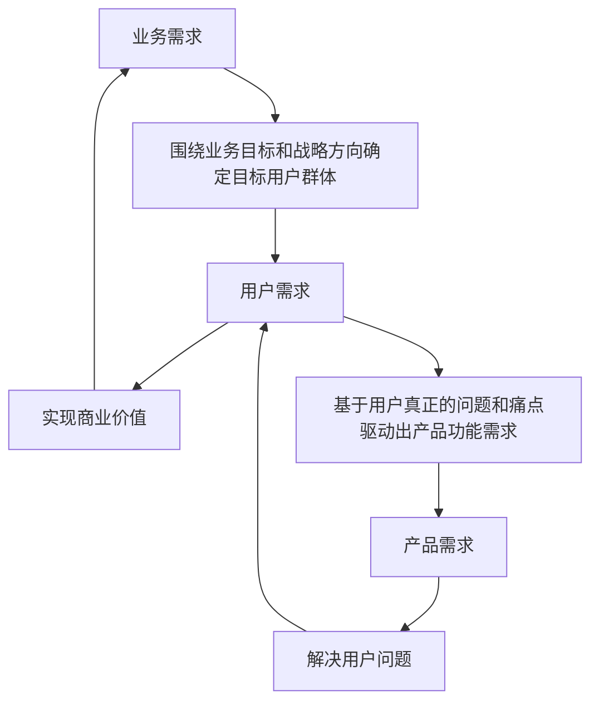

## 整体思路

- 价值交付-方案共识-交付共识-成效共识
- 目标数字化-业务需求线上化-效果数字化

目标：
- 强化业务需求的价值导向与目标对齐
通过目标主题的线上化和需求的分层管理，使每个阶段的工作都聚焦在高业务价值的需求上，确保需求方向和产品战略一致。
- 构建需求评审与版本规划的闭环机制
通过需求评审、迭代交付和定期反馈的闭环管理，使需求在开发过程中保持灵活性，确保每个阶段均有效推进，提高整体交付效率。

核心场景：
① 需求评估：规范需求评估机制，确保需求的业务价值和技术可行性，提升需求的优先级管理和准确性。
② 方案设计：确保设计方案能够满足业务需求，最大化业务价值，同时为开发实施和未来产品化提供清晰的指引。
③ 版本规划：平衡常规和定制版本规划，实现高优先级需求的有序交付，确保产品在每次迭代持续增值并遏制定制化趋势。

关键指标：
① 需求评估率
② 设计通过率
③ 版本定制率

需求线上化：全透明从产品策略到落地执行过程
公司战略 -> 产品线目标 -> 产品策略 -> 版本规划 -> 迭代计划 -> 每日工作

需求受理 -> 需求评估中 -> 方案设计中 -> 设计已评审 -> 需求已拆分 -> 研发中 -> 验收中 -> 已发布 -> 已完成
产品故事协作过程: 开放 -> 已受理 -> 已分配 -> 开发中 -> 评审中 -> 待测试 -> 测试中 -> 已完成

产品目标具体： 产品经理根据公司战略以及自身产品定位，明确产品年度/季度具体、可量化的目标或主题（X件大事），并将这些内容清楚地传达给了团队。
版本规划清晰： 产品经理结合自身主动规划（产品目标）和外部需求，为每一个发布版本树立了明确的目标和清晰的范围，并与团队达成共识。
需求分层：
1、根据滚动规划的粒度先粗后细的原则，将业务需求拆分后进行分层管理（业务需求-产品故事-研发任务）；
2、对需求做多维度的属性划分，确保核心需求在标准版里实现，把握好产品的边界。
3、团队总是按优先级交付，团队的开发、测试人员也是有意识地按优先级工作，确保更高价值故事尽快交付。
需求审核：所有需求经专人审核后再开展需求分析和需求拆分工作，然后再排入团队迭代计划，避免“打黑工”行为。
定制化评估： 能够理性分析并定义业务需求的价值，综合评估市场需求与资源投入以及长期产品战略，来明确业务需求是通过产品化或定制化方式实现并记录决策过程。
设计评审：
1、团队在业务需求进入版本/迭代开发前提前完成了技术方案的概要设计和评审（主要关注外部集成依赖、服务或组件模型、逻辑数据结构、以及非功能性质量考虑，尽早识别和解决技术风险，保证版本/迭代交付过程能顺利展开；
2、每一个故事进入开发前对其技术方案进行分析，输出轻量级的技术方案描述（尤其是组件结构和与外部之间的集成依赖的集成设计），大需求会进行详细设计，识别和解决技术风险。
产能可控： 团队大多数成员能进行故事估算，团队根据自身实际容量和历史产能制定可行的、可承诺的迭代计划，不会经常过度承诺或承诺不足。团队有相对稳定的迭代完成率，完成率上下浮动不超过20%。
移测准时： 开发人员能够在迭代开始前与测试人员一起共识移测时间，并能在迭代过程中分批次准时移测产品故事。移测故事已完成自测并对质量有保证。
节奏稳定： 建立固定的双周迭代节奏，具有月度发版的能力。团队和产品经理能遵循迭代日历按时完整地进行各项关键活动，包括产品故事清单梳理和估算、迭代计划、站会、Showcase、迭代回顾。
完成达标： 团队对迭代和产品故事是否“完成”有明确的判断标准；最基础的，能够在一个迭代内即完成开发，也完成系统测试，并修复所有重要及以上严重程度的缺陷，达到足够的质量标准。
代码评审： 团队建立了例行的代码评审机制，有代码检查单便于自查。对提交代码的质量进行一对一或集体评审，并有机制确保评审发现的问题都进行了修复
单主干开发： 团队围绕产品及功能建立单一产品主干，迭代开发按需进行版本定期发布，不存在长期并行针对具体客户的版本分支。

***迭代实践 – 需求和迭代***：
- 需求方案评审
1、针对项目和迭代业务需求编写需求方案，并组织评审。
- 需求方案宣讲
1、在迭代启动前对业务需求进行方案宣讲。
2、个别需求一对一宣讲。
- 故事拆分
1、基于评审的需求方案进行初次故事拆分，该部分需求进入需求池；
2、开发基于工作量评估，对粒度过大的需求提议二次故事拆分。
- 预分配迭代
1、对于需要在当次版本开发的需求拉入到预分配迭代。

***迭代实践 – 开发和测试***
- 设计方案评审
1、针对模块、项目进行开发方案设计。
- 制定开发计划
1、开发负责人负责分配开发人员
2、开发人员进行开发计划制定
3、产品经理基于开发计划拉需求进对应迭代。
- 制定测试计划
1、测试负责人负责分配测试人员。
2、测试人员进行测试计划制定。
3、产品经理基于测试计划调整迭代。
- 测试用例评审
1、针对模块、项目进行测试用例评审。
- 代码评审
1、针对前端和后端代码分别评审。

## AAR复盘认知与应用

***AAR的特点***
- 聚焦关键问题/关键时刻，不讲求面面俱到，而要抓重点，会议高效简短
- 循环时间越短越好，获得即时的反馈，识别经验教训，并立即应用这些经验教训
***AAR适用场景***
- 会重复进行的活动
- 有清晰的可衡量目标、明确起始、终止的活动。
- eg：项目迭代回顾、特性开发、补丁交付、问题攻关、敏捷开发可以每2周实施一次AAR，瀑布开发项目可以阶段结束或项目里程碑时进行AAR。

AAR引导记录表单：
我们原来期望和目标是什么？你原来期望发生什么.
实际发生了什么/有什么是超出期望的？
超出期望或造成差异的原因是什么？
我们从中学到了什么？
改进建议/下一次我们该怎么做？
行动负责人 
计划完成时间 
状态
该经验还需分享给谁
跟踪效果评估（措施落地效果）
备注

***AAR复盘价值：***
- 团队内：团队学习成长
有效帮助捕获项目重要经验教训，持续学习，不断改进
促进组织内隐性知识沉淀，避免知识因项目解散而流失
通过集体的学习，丰富团队成员的经验和知识，促进团队的成长
团队将能更熟练的设定实际、可达成的目标
帮助成员对团队发生的事情及意义形成统一的观点 或理解，这是团队达成进一步共识的基础
帮助建立团队坦诚、开放的氛围
- 团队间：经验传递与沉淀
经验教训的分享，将避免问题重犯、识别机会点、应用好的实践

***AAR的最终目的-提高未来绩效***
- 不犯重复错误
许多组织相同或相似的问题屡次出现，就是因为缺少AAR这个环节。AAR系统能帮助组织找出失败之处，从而采取正确的措施，避免错误的再次发生。
- 发现改进机会
工作很难一次做到十全十美，都可能或多或少存在着改进的机会，做完后回头看一下，常常会发现更好的方法。这其中也包含重大的创新机会，有些非预料的意外事件可能就会带来有价值的创造发明，不同观点的碰撞也可能激发新创意的产生。
- 固化成功经验
通过AAR，我们能够确定做出了什么成绩，哪些做法是有效的，并需要保持下去，按照已经证明是正确的方法去做，就能够保证未来的重复成功。
- 提升员工能力
AAR的过程是一个知识分享的过程，它源于实践，又高于实践，对参与者来说，能有效地提升其专业技术能力、沟通能力、分析与解决问题等多方面的能力，同时丰富自身的知识储量和实践经验。

角色认知
Ø 中立性：引导人必须保持中立，不偏袒任何一方，才能公正地引导讨论；
Ø 沟通技巧：需要优秀的沟通和协调能力，能够有效处理冲突和情绪；
Ø 敏锐观察：能够敏锐地察觉潜在的情绪和冲突，并及时干预。
建议人选
Ø 通常选择与事件无直接利害关系的人，例如经理或外部顾问；
Ø 必须有良好的声誉和公信力，能够得到所有参与者的信任。
引导员
角色认知
Ø 全面了解：叙述人需对项目的全过程有全面了解，能够提供完整和准确描述；
Ø 客观性：描述应尽量客观，中立，不夹杂个人情感和偏见；
Ø 清晰表达：能够清晰、简明地表达复杂的信息，确保所有人都能理解。
建议人选
Ø 选择项目的核心成员，例如项目负责人或关键参与者；
Ø 要求具备良好的表达能力和客观性，能够准确描述事实。
叙述人
角色认知
Ø 批判性思维：需具备批判性思维，能够提出挑战性问题，深入剖析问题本质；
Ø 系统思维：理解事件全局，能从系统角度思考问题，发现隐藏问题和改进点；
Ø 开放性：愿意听取不同观点，促进全面讨论。
建议人选
Ø 选择具备丰富经验和深厚专业知识的人，例如资深专家或高级管理人员；
Ø 需要具备良好的倾听能力和提问技巧，能够引导建设性的讨论。
设问人

## 敏捷理念：减小批量、稳定节奏、拆分团队、可视化&可度量
- 把工作拆分成一系列小而具体的交付物；按优先级排序，估算每项任务的相对工作量
- 把组织拆分成小规模的、跨功能的特性小队
- 把时间拆分成固定大小的短迭代（通常为 1-4 周）
- 用看板将流程可视化，设定WIP，度量生产周期

Scrum是⼀种敏捷的、基于团队的增量软件开发框架。Scrum 团队以迭代（Sprint）的方式进行交付，迭代期间团队一起计划、执行以及评审工作成果，每个迭代都为最终目标贡献有价值增量。

Kanban是一种渐进式地组织过程改进方法。相比Scrum 更强调价值流动而不是节奏，并通过可视化、限制在制品、管理流动、显示化规则等方式，尊重现状以较小摩擦推动变⾰。

## 看板方法：科技企业渐进变革成功之道

- 看板：价值流与卡片的组合，端到端可视化展现卡片（工作对象）的进展。
- 卡片：工作对象，如故事，每个对象对应一张卡片。
- 价值流：反应工作项从开始到完成的端到端价值增值过程。
- 步骤/状态：价值流的“列”。反映工作项当前状态进展，多个卡片处于某个步骤形成队列。卡片处于特定步骤的原因有两种，第一是工作正在被处理（如开发进行中）；第二是工作等待进入下一个环节（如：开发完成后的待测试）。
- 泳道：价值流的“行”。常用的分割泳道的依据是需要给予不同的关注，如优先级差异等；或处理规则不同，如对常规需求和线上问题的处理规则是不一样的。团队可以根据实际需要定义泳道。
- 拉动/拖动：让卡片进入后续步骤的操作，体现工作项的进展和价值增加。电子看板中点中卡片直接拉动到所在步骤即可
- 阻塞：工作项的推进过程中遇到困难或阻力，需要其他人的支持或协助。

## 团队管理Tips

***信息全透明*** 团队有效运用了电子看板将各种管理信息透明化，比如版本/迭代关键活动安排，每个版本/迭代的计划，进度跟踪，任务分配，风险和问题，重点改进事项等，管理者可通过看板直观的了解团队运行情况。
***研发数字化*** 产品和研发团队的产品规划、需求管理、版本/迭代管理、持续集成、持续交付，都有工具平台支持并全量线上化，提高管理效率和规范性。
***团队易协同*** 当一个较大的解决方案或项目集由多个紧密关联的产品团队构成时，存在有效的机制在多个团队之间进行例行的沟通协调，相关干系人都能参加，积极管理彼此的依赖和影响，做到计划和进度对齐。既保持各团队相对独立运作，又确保跨团队的工作能够及时高质量交付。

***产品是什么？***
产品是通过数字化技术创建，以软件为关键组成部分，具备独特价值点的软件系统、平台、组件或终端应用等。
***产品价值点如何定义？***
产品具有独特的价值点，是组织为某类客（用）户提供独特价值的载体。

## 产品生命周期管理：不同阶段不同举措，因地制宜因时而变

|客户数量产品阶段   0|启动孵化期 |试点引入期  1| 成长期   10| 成熟期   100|衰退/转型期   N|
| -- | -- | -- | -- | -- | -- |
|阶段重点 | 构想-原型设计 | 推演-试点验证 | 探索-复制推广 | 适应-迭代优化 | 转型-升级换代 |  
| 目标设定参考 | 确定目标市场与客户。产品原型设计与验证。 | 吸引天使客户，形成早期市场份额。初步建立产品认知度。 | 改进、优化产品功能，持续提高产品竞争力。快速增长，扩大市场份额，开始盈利 | 保持市场份额，寻找新的市场机会。控制成本，提高产品利润率。 | 在确保利润率的基础上，最大程度地延长产品寿命。优化资源投入，削减不必要的成本。寻找替代产品或市场，探索产品创新、改进或转型。 |

***需求是什么？***
需求是在不确定性环境下，建立在商业、技术、用户之间的一组动态的、待验证的假设。澄清需求的过程就是不断验证假设、在试错中学习，逐步接近问题与方案、产品与市场的“平衡点”的过程。

需求提出 --> 需求粗评估 --> 需求预排期 --> 需求分析细化 --> 需求评审 --> 方案设计 --> 设计评审 --> 需求排期 --> 需求拆分 --> 产品需求子流程 --> SIT测试 --> 产品验收 --> UAT测试 --> 安全测试/性能测试 --> 缺陷分析 --> 发布评审 --> 版本发布 --> 需求关闭